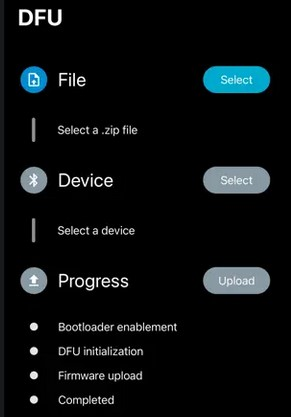

# DiceFirmware

Firmware for the Bluetooth Pixels dice, based on Nordic's nRF5 SDK (available
[here](https://www.nordicsemi.com/Products/Development-software/nRF5-SDK/Download#infotabs)).

## Programming a Pixels electronic board via USB

### Hardware Setup

We use a J-Link debug probe from Segger to connect a computer to a die's electronic board.


*J-Link connected to a die electronic board with a flat ribbon cable.*

Plug one end of the flat ribbon cable into the J-Link and the other end into custom adapter.
On the small side of the adapter, pull the black end of the connector away from the board to open it.


*Custom Pixels adapter with a flat ribbon cable connector on one end and a tiny connector for the electronic board on the other end.*

Then insert the flexible dice board with the electric lines facing down, and close the connector.

## Programming

[Download](https://www.nordicsemi.com/Products/Development-tools/nRF-Command-Line-Tools/Download#infotabs)
and install nRF Command Line Tools for Win32 (version 10.17.0 at the time of writing).
During the installation process, you should be prompted to also install the J-Link drivers.

Flashing a die is done in 3 steps: erase, program and reset:

```
nrfjprog -f nrf52 --eraseall
nrfjprog -f nrf52 --program firmware.hex --verify
nrfjprog -f nrf52 --reset
```

The `--verify` option compares the provided hex file contents with the data in the chip memory
and fails if there is a mismatch.

It's possible to combine all 3 steps together:

```
nrfjprog -f nrf52 --program firmware.hex --chiperase --verify --reset
```

Firmware releases are available on the releases
[page](https://github.com/GameWithPixels/DiceFirmware/releases) of this repository.
To program the board, download the .hex file from the latest release,
and run the commands above from the directory where the .hex file was saved
(be sure to change `firmware.hex` in the command to the correct filename).

## Device Firmware Upgrade (DFU)

Nordic provides the tools to update the firmware wirelessly using Bluetooth.
The Pixels app will eventually support updating the Firmware automatically but at the moment
it is best to use the Nordic tools.

The Nordic DFU app is available on the Apple [App Store](
    https://apps.apple.com/us/app/nrf-device-firmware-update/id1624454660
) and on [Google Play](
    https://play.google.com/store/apps/details?id=no.nordicsemi.android.dfu
).



*Screenshot of the Nordic DFU app showing the three different steps to update a device: select DFU file, select device and upload.*

With this app updating your Pixels dice is done in three steps:

### Select Firmware File

DFU files are packaged as zip files.
We publish Pixels DFU files as part of our firmware releases [here](
    https://github.com/GameWithPixels/DiceFirmware/releases
).

Always favor using the latest published Firmware as older versions might not be compatible
with the latest Pixels software.
To get to the DFU zip file, unfold the "Assets" list and click on the zip file which name
starts with "firmware_" followed by a date.

You will also find a "bootloader_" DFU zip file.
We do not recommend to update the Bootloader unless you know what you are doing.

Please note that the zip file which name starts with "firmware_hex_" won't work with the
DFU app.
The files in this zip are intended to be used with different tools and a Pixels electronic
board that is physically connected to a computer.

### Select Pixels Device

After selecting the DFU file you may select your Pixels die.
All nearby Bluetooth Low Energy device will be displayed in this list.

When turned on the die name should also appear in the list.
If not try to reset your Pixels die by placing it back into its box and covering it with the lid.
Wait at least five seconds before removing the lid.

Occasionally you may see a "PXL????????" or "Dfu?????" device (where the question marks
may be letters or numbers).
Those are the possible names that the die advertise while running the bootloader.
The latter is a piece of software that is run on boot before executing the firmware.
You should select one of those names only if your die name doesn't appear after a few seconds.

### Uploading

Upon pressing the "Start" button the app will attempt to update the firmware on the selected
device.

Usually the app will start showing the update progress almost immediately.
However if the app appears to blocked in one the first update steps then try to reset the die
by placing the die back into its box, covering it with the lid and wait at least five seconds
before removing the lid.

The update should then proceed and the app will let you know when it's done. The die automatically reboots
at the end of the process and runs the updated firmware.

*Note:* The update will fail is the selected device is not a Pixels die.

## Building The Firmware

### Environment Setup on Windows

The requirements are the same than for building the dice *bootloader*.
Check out the instructions on the *bootloader*'s GitHub
[page](https://github.com/GameWithPixels/DiceBootloader#readme).

Be sure to first build the *bootloader*.
The *Makefile* expects the *DiceBootloader* project to located in the same parent directory
than this project.

### Building

Make sure that the *Makefile* `SDK_ROOT` variable is pointing to the correct directory.

Open a command line and go the directory where this repository is cloned and run `make`.

The output files are placed in the `_builds` directory, by default those are debug files (not release).
The one that we want to program to the flash memory is the `.hex` file
(more about this format [here](https://en.wikipedia.org/wiki/Intel_HEX)).

*Note:* you may need to update the SoftDevice to the version specified in the *Makefile*
as Nordic doesn't always publish a new SDK when they release a SoftDevice update.

## Programming a Pixels electronic board with *make*

Using the project's *Makefile* you may:

### Debug Build Commands

* `clean_debug`: deletes the intermediary debug build directory.
* `firmware_debug` (default): produces a debug build of the firmware => `firmware_d.hex`
* `settings_debug`: generates the bootloader settings page for a debug build
* `flash`: programs the firmware into the die's memory and reboot the device
* `reflash`:calls `erase`, `flash_softdevice` and `flash` in a sequence

*Note:* debug builds being quite bigger than release ones,
we usually don't have enough memory to flash the *bootloader* with them.

### Release Build Commands

* `clean_release`: deletes the intermediary debug build directory.
* `firmware_release`: produces a release build of the firmware => `firmware.hex`
* `settings_release`: generates the bootloader settings page for a release build
* `flash_release`: programs the firmware into the die's memory and reboot the device
* `reflash_release`: calls `erase`, `flash_softdevice` and `flash_release` in a sequence
* `flash_board`: calls `erase`, `flash_softdevice`, `flash_bootloader` and `flash_release` in a sequence

### Publishing Commands

* `hex_release`: produces a full hex file with Bootloader, SoftDevice and release Firmware
* `zip`: cleans up temporary build files before building, produces a zipped DFU package
         with the SoftDevice and the Firmware.
* `zip_bl`: produces a zipped DFU package with the Bootloader.
* `publish`: runs `zip`, `zip_bl`, `hex_release` and `hex_validation` commands and copies the output
             files in a sub-directory of the "_build" directory. This sub-directory has the date/time
             of the build in its name.

### Other Commands

* `reset`: restart the device
* `erase`: entirely erase the flash memory
* `flash_softdevice`: program the *SoftDevice* into the die's memory and reboot the device
* `flash_bootloader`: program the bootloader into the die's memory and reboot the device

### Dependencies

Some commands requires `nRF Util` to run properly (see
[documentation](https://infocenter.nordicsemi.com/topic/ug_nrfutil/UG/nrfutil/nrfutil_intro.html)
about this tool).

The *Makefile* expects to find `nrfutil.exe` in the current directory or from the `PATH`.
Search for `NRFUTIL` to set a different path.
We're using the 6.1.3 build that can be downloaded from
[GitHub](https://github.com/NordicSemiconductor/pc-nrfutil/releases/tag/v6.1.3).

The *Makefile* runs a few Python 3 code snippets and expects Python 3 to be available from the current directory.

## Versioning

The *Makefile* has several variables to manage build versioning:

* `BUILD_TIMESTAMP`: the [Unix time](https://en.wikipedia.org/wiki/Unix_time) (or Epoch time) at which the build was started.
* `BUILD_DATE_TIME`: the above timestamp formatted as an ISO 8601 date/time string.
* `FW_VER`: the Firmware version number stored in the NRF settings.
* `BL_VER`: the Bootloader version number stored in the NRF settings.

The build timestamp is stored in the firmware code and communicated to applications via Bluetooth advertising and by BLE message once connected.
This timestamp is used by applications to determine if the die is running the expected firmware version.

The build date/time string is used for naming build filenames in order to indicate when the build was generated.
This is purely informational and helps a human user manage build files.
Removing or changing the date/time in the build filename has no consequence other than confusing people ;)

The Firmware and Bootloader versions are used by the Nordic tools to control what  updates may be uploaded or not to the die flash memory.
For example it can be used to prevent downgrading to an older version.
Different applications using Pixels may expect different firmware versions, and we want those applications to flash the version they need to connected dice.
So we are not using Nordic's versioning system at the moment. Both values are left to 1.

*Note:* when generating a release build, be sure to fully rebuild the firmware as the source files using the build timestamp need to be recompiled to use the current timestamp.

## Output logs in Visual Studio Code

Install Arduino [extension](https://marketplace.visualstudio.com/items?itemName=vsciot-vscode.vscode-arduino)
from Microsoft.
It enables access to the serial port to the die's electronic board (through USB).

To connect to the die electronic board, run the following commands in VS Code:
* `Arduino: Select Serial Port` and select the COM port for the JLink
* `Arduino: Open Serial Monitor`

Because logs are actual string, they need to be stored in firmware.
This takes a lot of space which is one the reason why we remove logs from release builds.
As a consequence only a debug build will output logs through the serial monitor.

## Memory Optimizations

One of the targets of the Firmware *Makefile* is aimed to help track code size and ram utilization.
For this we take advantage of [Govind Mukudan's MapViewer tool](https://github.com/govind-mukundan/MapViewer)
which parses GCC's output files (.map and .elf) to compute function and variable sizes.

### Setting up MapViewer
- Download *Mapviewer* from their [Releases](https://github.com/govind-mukundan/MapViewer/releases) page.
- Open *Mapviewer* and click on the Settings button.
- Set the paths to NM and ReadElf according to your current SDK setup (see image below)


### Building for MapViewer
- Simply use the 'make memory_map' target, this will build the firmware in release mode (removing debug messages). However, it will not perform Link Time Optimizations (which normally reduce the code size further) because LTO mangles all the source files and symbols and make the map file unusable.

### Inspecting firmware memory map
- Open firmware.map and firmware.elf and click *Analyse*
- You should see object files populate the left-side list view.


# Validation Mode

This special runtime mode makes the die blink it's device id using the LEDs,
allowing an app to read it for automatic BLE connection.
This is notably used during the validation process of a board or a die.

The *Validation* mode is enabled by setting the lowest significant bit of the first UICR customer register to 0.
It may be disabled afterwards by setting the second LSB of that same register to 0.
This may be done by directly programming the UICR register (see `validation_bit` and `exit_validation_bit` targets
in the *Makefile*) or by sending an `ExitValidation` Bluetooth message to the device.

An hex image of a normal *Release* build may be altered to include the *Validation* UICR bit
(see `hex_validation` target in the *Makefile*).

# Firmware Coding Style Guide

Check [style guide](style.md) for up-to-date style guidelines. 
