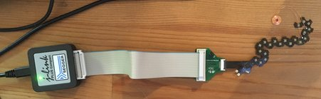
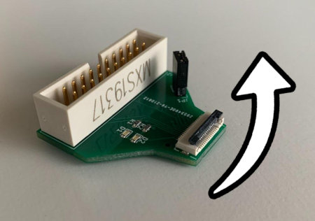
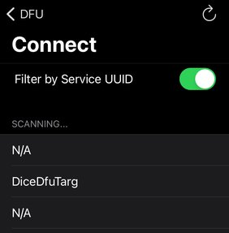
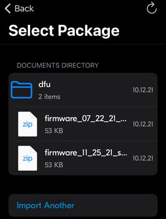

# DiceFirmware

Firmware for the Bluetooth Pixel dice, based on Nordic's nRF5 SDK (available
[here](https://www.nordicsemi.com/Products/Development-software/nRF5-SDK/Download#infotabs)).

## Programming a Pixel's electronic board via USB

### Hardware Setup

We use a J-Link debug probe from Segger to connect a computer to a die's electronic board.



Plug one end of the flat ribbon cable into the J-Link and the other end into custom adapter.
On the small side of the adapter, pull the black end of the connector away from the board to open it.



Then insert the flexible dice board with the electric lines facing down, and close the connector.

## Programming

[Download](https://www.nordicsemi.com/Products/Development-tools/nRF-Command-Line-Tools/Download#infotabs)
and install nRF Command Line Tools for Win32 (version 10.12.2 at the time of writing).
During the installation process, you should be prompted to also install the J-Link drivers.

Flashing a die is done in 3 steps: erase, program and reset:

```
nrfjprog -f nrf52 --eraseall
nrfjprog -f nrf52 --program firmware.hex --verify
nrfjprog -f nrf52 --reset
```

The `--verify` option compares the provided hex file contents with the data in the chip memory
and fails if there is a mismatch.

It's possible to combine all 3 steps together:

```
nrfjprog -f nrf52 --program firmware.hex --chiperase --verify --reset
```

Firmware releases are available on the releases
[page](https://github.com/GameWithPixels/DiceFirmware/releases) of this repository.
To program the board, download the .hex file from the latest release,
and run the commands above from the folder where the .hex file was saved
(be sure to change `firmware.hex` in the command to the correct filename).

## Device Firmware Upgrade (DFU)

Nordic provides the tools to update the firmware through Bluetooth.
This is the only way to update our electronic boards once encased in a Pixel die.

You may use Nordic's [nRF Toolbox](https://www.nordicsemi.com/Products/Development-tools/nRF-Toolbox)
app to push a firmware update to a Pixel. Once the app is started, scroll down and tap on
"Device Firmware Upgrade (DFU)" and then "Connect".

*Note*: the Bootloader DFU inactivity timeout is set to 1 second (as opposed to 3 seconds in older builds),
which currently prevents the Android app to connect to the die for pushing an update.
This is caused by delays introduced in the Android app code to support old phones.
This [issue](https://github.com/NordicSemiconductor/Android-DFU-Library/issues/329)
will be eventually fixed, please use an iOS device to do a DFU via Bluetooth until then.



This page shows the scanned Bluetooth Low Energy devices. The name of any nearby Pixel should appear.
This name is advertised by the die firmware.
But in order to proceed with a DFU update, we need to connect to the *bootloader*.
The latter is run when the die is turned on and stay active for just 1 second.
Then, if no DFU request was made during that time, the die transition to running the firmware.

Turn the dice off and back on and immediately tap on the circling arrow located on the top right corner
of the app to refresh the list of Bluetooth devices.

You should see a new entry named "DiceDfuTarg" which is the name that the *bootloader* is advertising.
Upon selecting it, a list of available packages is displayed. Those are zip files containing the firmware
and some settings.



You must first import into the app the package containing the firmware update.
Such packages are available on the releases
[page](https://github.com/GameWithPixels/DiceFirmware/releases) of this repository.
Once that done, select the package in the list and tap on the "Update" button located at the bottom of the screen.

At this point the die will most likely be done running the *bootloader* as it only stays active for 3 seconds.
Turn the dice off and back on again to let the app connect to the *bootloader* and proceed with the update.
Tap on "Retry" if you get a "Device failed to connect" error.

The update should then proceed and the app will let you know when it's done. The die automatically reboots
at the end of the process and runs the updated firmware.

## Building The Firmware

### Environment Setup on Windows

The requirements are the same than for building the dice *bootloader*.
Check out the instructions on the *bootloader*'s GitHub
[page](https://github.com/GameWithPixels/DiceBootloader#readme).

Be sure to first build the *bootloader*.
The *Makefile* expects the *DiceBootloader* project to located in the same parent directory
than this project.

### Building

Make sure that the *Makefile* `SDK_ROOT` variable is pointing to the correct folder.

Open a command line and go the folder where this repository is cloned and run `make`.

The output files are placed in the `_builds` folder, by default those are debug files (not release).
The one that we want to program to the flash memory is the `.hex` file
(more about this format [here](https://en.wikipedia.org/wiki/Intel_HEX)) .

## Programming a Pixel electronic board with *make*

Using the project's *Makefile* you may:

* `reset`: restart the device
* `erase`: entirely erase the flash memory
* `flash_softdevice`: program the *SoftDevice* into the die's memory and reboot the device
* `flash_bootloader`: program the bootloader into the die's memory and reboot the device

**For debug builds:**

* `firmware_debug` (default): produce a debug build of the firmware => `firmware_d.hex`
* `settings_debug`: generate the bootloader settings page for a debug build
* `flash`: program the firmware into the die's memory and reboot the device
* `reflash`:call `erase`, `flash_softdevice` and `flash` in a sequence

*Note:* debug builds being quite bigger than release ones,
we usually don't have enough memory to flash the *bootloader* with them.

**For release builds:**

* `firmware_release`: produce a release build of the firmware => `firmware.hex`
* `settings_release`: generate the bootloader settings page for a release build
* `flash_release`: program the firmware into the die's memory and reboot the device
* `reflash_release`: call `erase`, `flash_softdevice` and `flash_release` in a sequence
* `flash_board`: call `erase`, `flash_softdevice`, `flash_bootloader` and `flash_release` in a sequence
* `publish`: produce a zipped DFU package (also copied in the `binaries` folder)

Some commands requires `nRF Util` to run properly (see
[documentation](https://infocenter.nordicsemi.com/topic/ug_nrfutil/UG/nrfutil/nrfutil_intro.html)
about this tool).

The *Makefile* expects to find `nrfutil.exe` in the current folder or from the `PATH`.
Search for `NRFUTIL` to set a different path.
We're using the 6.1.3 build that can be downloaded from
[GitHub](https://github.com/NordicSemiconductor/pc-nrfutil/releases/tag/v6.1.3).

The *Makefile* runs a few Python 3 code snippets and expects Python 3 to be available from the current directory.

## Versioning

The *Makefile* has several variables to manage build versioning:

* `BUILD_TIMESTAMP`: the [Unix time](https://en.wikipedia.org/wiki/Unix_time) (or Epoch time) at which the build was started.
* `BUILD_DATE_TIME`: the above timestamp formatted as an ISO 8601 date/time string.
* `FW_VER`: the Firmware version number stored in the NRF settings.
* `BL_VER`: the Bootloader version number stored in the NRF settings.

The build timestamp is stored in the firmware code and communicated to applications via Bluetooth advertising and by BLE message once connected.
This timestamp is used by applications to determine if the die is running the expected firmware version.

The build date/time string is used for naming build filenames in order to indicate when the build was generated.
This is purely informational and helps a human user manage build files.
Removing or changing the date/time in the build filename has no consequence other than confusing people ;)

The Firmware and Bootloader versions are used by the Nordic tools to control what  updates may be uploaded or not to the die flash memory.
For example it can be used to prevent downgrading to an older version.
Different applications using Pixels may expect different firmware versions, and we want those applications to flash the version they need to connected dice.
So we are not using Nordic's versioning system at the moment. Both values are left to 1.

*Note:* when generating a release build, be sure to fully rebuild the firmware as the source files using the build timestamp need to be recompiled to use the current timestamp.

## Output logs in Visual Studio Code

Install Arduino [extension](https://marketplace.visualstudio.com/items?itemName=vsciot-vscode.vscode-arduino)
from Microsoft.
It enables access to the serial port to the die's electronic board (through USB).

To connect to the die electronic board, run the following commands in VS Code:
* `Arduino: Select Port` and select SEGGER
* `Arduino: Open Serial Monitor`

## Memory Optimizations

One of the targets of the Firmware makefile is aimed to help track code size and ram utilization. For this we take advantage of [Govind Mukudan's MapViewer tool](https://github.com/govind-mukundan/MapViewer) which parses gcc's output files (.map and .elf) to compute function and variable sizes.

### Setting up MapViewer
- Download Mapviewer from their [Releases](https://github.com/govind-mukundan/MapViewer/releases) page.
- Open Mapviewer and click on the Settings button.
- Set the paths to NM and ReadElf according to your current SDK setup (see image below)


### Building for MapViewer
- Simply use the 'make memory_map' target, this will build the firmware in release mode (removing debug messages). However, it will not perform Link Time Optimizations (which normally reduce the code size further) because LTO mangles all the source files and symbols and make the map file unusable.

### Inspecting firmware memory map
- Open firmware.map and firmware.elf and click *Analyse*
- You should see object files populate the left-side list view.


# Validation Mode

This special runtime mode makes the die blink it's device id using the LEDs,
allowing an app to read it for automatic BLE connection.
This is notably used during the validation process of a board or a die.

The *Validation* mode is enabled by setting the lowest significant bit of the first UICR customer register to 0.
It may be disabled afterwards by setting the second LSB of that same register to 0.
This may be done by directly programming the UICR register (see `validation_bit` and `exit_validation_bit` targets
in the *Makefile*) or by sending an `ExitValidation` Bluetooth message to the device.

An hex image of a normal *Release* build may be altered to include the *Validation* UICR bit
(see `hex_validation` target in the *Makefile*).

# Firmware Coding Style Guide

Check [style guide](style.md) for up-to-date style guidelines. 
